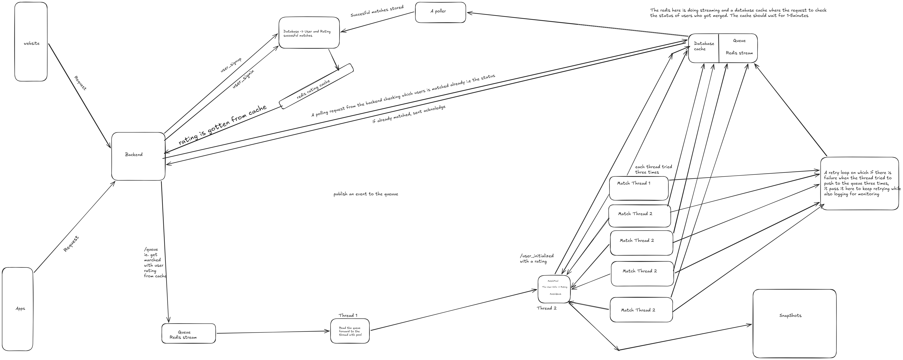

# 5v5 Real Time Competitive Matchmaker

A thread safe, high throughput matchmaking service in Rust. Players queue over
HTTP and are continuously grouped into balanced 5v5 games. It is built on
Actix-Web for HTTP, Diesel with Postgres for persistence, and Redis for both
streaming and caching.

This document is the brief writeup the task asks for. It covers how I tackled
the engineering challenges, the algorithmic trade offs, the complexity, and the
scaling decisions. For setup, deployment, the full endpoint list, and
operational commands, see [SETUP.md](SETUP.md).



While building this I read a few references on competitive matchmaking. The one
that shaped the design most was Saurav Pal, *Cinder: A fast and fair matchmaking
system* (arXiv:2602.17015). I took from it the idea of skill buckets and the
two stage "fast filter, then a precise fairness check" structure, and adapted
those into the concurrent, queue driven service described below.

## How I tackled the engineering challenges

### 1. Latency versus match quality

The central tension is that insisting on perfectly balanced teams makes players
wait, while matching anyone quickly produces lopsided games. I resolve it with
time based constraint relaxation. A freshly queued group must be tightly
balanced, and the maximum allowed team skill gap (`t_max`) grows linearly with
the longest waiting player's wait time (`t_max = base + alpha * wait`, capped).
Fairness is therefore strict early and loosens only as much as needed to keep
anyone from starving. Those relaxation constants are the single knob that slides
the whole system along the latency versus quality curve.

### 2. Thread safe state and atomic eviction

The player pool is partitioned into many narrow skill buckets, each a FIFO
`VecDeque` behind its own lock, so workers operating on different buckets never
contend. Work is distributed by a "bucket carousel": all workers share one
atomic ticket counter, and each claims a small window of buckets via
`fetch_add(STRIDE) % NUM_BUCKETS`, wrapping around endlessly. A worker gathers
its 10 players and removes them while still holding the bucket lock, so eviction
is atomic and no other worker can observe or claim a half matched player. Border
crossings between adjacent buckets use a non blocking `try_lock` in strict
ascending index order, which makes a circular wait, and therefore a deadlock,
impossible. A failed claim rolls the taken players back to the fronts of their
queues.

### 3. Time based constraint relaxation

This is the mechanism behind challenge 1. Because the buckets are FIFO, the
longest waiting player is always at the front, giving an `O(1)` peek, so each
matching attempt anchors on the player most at risk of starving and relaxes the
skill window around them.

### 4. Team balance optimization

Finding 10 compatible players is only half the job. Splitting them fairly is the
other half. With 10 players there are exactly C(10,5) = 252 ways to form team A,
so I brute force all of them and choose the minimum of a hybrid penalty,
`macro_gap + sanction_score`. The macro term is `|sum(A) - sum(B)|`, the total
team strength gap. The micro term, the sanction score, is the 1D Wasserstein
distance `sum_i |sortedA[i] - sortedB[i]|`, which measures role by role parity.
The micro term distinguishes teams that tie on total strength but differ in
shape. Under load the average team gap is about 1 rating point.

I want to be honest about why I did not use a cheaper positional heuristic such
as a zig zag (snake) draft, which deals the sorted players out by a fixed
pattern like A,B,B,A,A,B,B,A,A,B. A fixed pattern ignores the actual ratings, so
it fails whenever the skill distribution is uneven. A concrete case: the lobby
sorted high to low is

```
[100, 74, 73, 73, 73, 26, 25, 23, 21, 0]
```

Zig zag produces team A = [100, 73, 73, 23, 21] = 290 and team B =
[74, 73, 26, 25, 0] = 198, a gap of 92. A perfectly fair split actually exists:
team A = [100, 74, 26, 23, 21] = 244 and team B = [73, 73, 73, 25, 0] = 244, a
gap of 0. Zig zag misses it entirely because it cannot react to the cliff at the
top and the cluster at the bottom. Across random lobbies I measured the
positional heuristic at roughly 50 times worse average team gap than the brute
force, so I kept the 252 evaluation, which is a fixed sub microsecond cost and
was never the throughput bottleneck.

### 5. Low latency health metrics

Monitoring must not slow the matching loop. All metrics are plain `AtomicU64`
counters that workers increment in passing, lock free and one instruction each,
and `GET /metrics` reads them with atomic loads. That includes the pool depth,
which is tracked as an atomic rather than by locking and counting buckets, so a
monitoring scrape never contends with a matcher on any lock at any frequency.
`Ordering::Relaxed` keeps the increments cheap. The trade is metrics that are
eventually consistent rather than transactional, which is exactly right for
health counters.

## Design decisions worth calling out

### I do not hold user data in the backend; it flows through Redis

The backend does not own runtime user state. On signup the user and rating go to
Postgres (the source of truth) and into a short lived Redis rating cache. When a
user wants to play, the backend publishes an event onto a Redis stream rather
than holding the player in process memory. This is a scaling decision: it keeps
the backend stateless, so I can run many backend instances behind a load
balancer without them needing to agree on who owns which user. Redis is the
shared bus between the stateless front and the matching engine.

### The pool lives in memory to avoid database calls on the hot path

Once a player is in the matchmaking pool, the matcher never calls the database
to make a decision. A waiting player carries the rating it was queued with, so
matching reads and writes only the in memory pool plus Redis, and the database
is never on the critical matching path. Postgres is touched only off the hot
path, by the write behind poller after a match is already formed.

### Why I kept the rating in the Redis cache rather than an in memory registry

A tempting alternative is to have the matching service own a full in memory
registry of every user's current rating and look it up from there. I chose not
to. The rating lookup happens when a player enters the queue, and at that point
the Redis cache is already fast and is trivial to scale and share across
instances. Keeping the rating only in Postgres (source of truth) and Redis
(cache), rather than also mirroring every rating into the matching process's
memory, means I never have to keep two in memory copies of a rating in sync with
the database. The pool holds only the small rating snapshot for the players
currently queued, which is bounded and disposable, not an authoritative registry
that would have to be invalidated whenever a rating changes.

### One pipelined write of 11 commands: the match and the cache together

When a match forms, the worker has two Redis jobs: update the 10 players' status
cache tickets so their next poll flips from queued to matched, and append the
match to the sync stream for persistence. Instead of 11 separate round trips, I
bundle all 11 commands (10 `SET` plus 1 `XADD`) into a single Redis pipeline, so
the worker makes one network round trip and Redis runs them sequentially in RAM.
Measured roughly 6 times faster per commit over loopback, and the gain is larger
over a real network where round trip latency dominates.

### Snapshots for crash recovery without a per write durability cost

The pool is in memory, so a crash would normally lose every waiting player. To
avoid that without paying a durability cost on every operation, the ingestion
thread reads the ingest stream from a cursor (the id of the last message read),
and a snapshotter periodically writes the pool's players plus that cursor to
disk, keeping the last few snapshots. On restart the service loads the newest
snapshot, restores those players, and replays the stream from the saved offset,
so no waiting player is lost. The stream is trimmed to twice the snapshot
interval, so the newest snapshot's offset always still exists in the stream. The
snapshot copies players under brief per bucket locks and does all serialization
and disk IO with no lock held, so it never stalls matching.

### A retry that preserves the match instead of rematching

Forming a match is the expensive work, so if the Redis write fails I never throw
the match away and rematch from scratch. The worker makes 2 fast inline retries,
and if it still fails it hands the fully formed match to an in memory retry queue
owned by a dedicated thread that keeps retrying with backoff until the write
lands. The 10 players stay matched the whole time; only the write is retried.

## Algorithmic trade offs

Brute force split over a heuristic: 252 integer sum evaluations is a fixed sub
microsecond cost and was never the bottleneck, so I kept the optimal split. A
heuristic would only pay off if team size grew, for example C(20,10) is about
185k.

Buckets narrow versus wide: narrow buckets give tighter matches and less lock
contention but more boundary cases where a group is split across a bucket edge;
wider buckets reduce boundaries but loosen match quality. Width is configurable.

Relaxation fairness versus wait time: linear widening is simple and bounded,
whereas a strict window that never relaxes gives perfect matches but unbounded
waits for tail skill players.

Write behind persistence versus synchronous: match threads write only to Redis
and never block on Postgres, which decouples matching throughput from database
latency at the cost of at least once semantics, with duplicates absorbed by
match id idempotency.

In memory pool versus a per request database lookup: keeping waiting players in
memory makes matching fast and database free, at the cost of needing the
snapshot and replay machinery to survive a crash.

## Complexity

Let `n` be players in a bucket and `k` the candidates inside the relaxed window.

| Operation           | Time         | Notes                                  |
|---------------------|--------------|----------------------------------------|
| enqueue             | `O(1)`       | push to a FIFO bucket                  |
| peek oldest         | `O(1)`       | FIFO front                             |
| gather 10 (harvest) | `O(k)`       | scan candidates in window and neighbours |
| atomic eviction     | `O(10)`      | pop 10 from queues                     |
| team split          | `O(252)`     | constant, fixed 10 player brute force  |
| metrics read        | `O(1)`       | atomic loads, no locks                 |
| DB write (batch)    | `O(b)` / txn | `b` matches per write behind batch     |

Space is `O(N)` for `N` waiting players, each about tens of bytes, plus
`O(NUM_BUCKETS)` lock overhead. The 252 split is fixed size and never dominates.

## Other Interesting Stuffs About Scaling. 

Vertical: more buckets and more workers gives near linear throughput until
bucket boundaries become the contention point. The carousel self balances,
because idle workers grab the next ticket and naturally cluster on the dense mid
MMR brackets where most players sit.

Signup is not a matchmaking concern and is not a ceiling on the engine. It can
live in its own backend service that scales independently, since it only writes
a user and rating to Postgres and warms the Redis cache. The matching service
never waits on it. Within the matching path the matcher drains players as fast
as they arrive, and the work that touches Postgres (persisting formed matches)
is deliberately batched and write behind so database latency never gates
matching throughput. The rating is cached in Redis so even a queue request
avoids a database read.

Horizontal: shard the pool by region or skill across machines and match within a
shard, since cross region matches are bad for latency anyway. This mirrors how
production matchmakers partition. Postgres stays the single source of truth and
Redis is the per shard bus and cache. Because the backend is stateless and the
data flows through Redis, the front can scale out independently.

Boundary players: a player whose relaxed window straddles a bucket edge is the
small scale analogue of the cross shard problem. It is handled here by ordered
`try_lock` border crossings, but it remains the part that scales least cleanly.

Durability: crash recovery of waiting players assumes Redis itself is durable
via AOF or RDB. The matchmaker process crashing is fully covered by the snapshot
and stream replay path.

## At a glance

Stack: Actix-Web, Diesel with Postgres, Redis streams and cache, JWT (HS256).

Flow: signup, then queue which returns 202 immediately, then poll `/status`
until matched. Matches are persisted write behind, and history is available at
`/matches` and `/players/{id}/matches`.

Verified under load: matches formed equals matches committed so nothing is lost,
about a 1 point average team gap, and no player is ever double booked.

See [SETUP.md](SETUP.md) for prerequisites, Postgres and Redis configuration,
build and run, the smoke test, load testing, every endpoint, and operational
commands for inspect, reset, and monitor.
